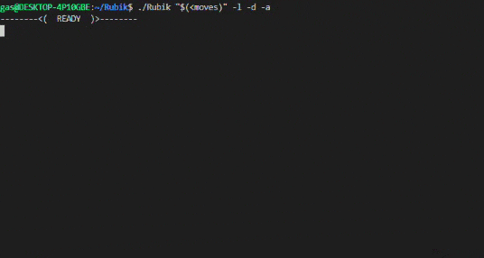

# Rubik
## Dependencies
The only dependencies you need are haskell and stack.  
To get them, check [here](https://www.haskell.org/platform/)
## Project
To start the project use:  
``` git clone https://github.com/glegendr/Rubik.git; cd Rubik; sh compile.sh ```  
You will get a binary call `Rubik`
## Description
This project is a Rubik's cube solver.    
He is created to return you a `small` algorithm to solve your cube from a shuffeled cube.   
This algorithm is an implementation of the [Thistlethwaite's algorithm](https://en.wikipedia.org/wiki/Optimal_solutions_for_Rubik%27s_Cube)
## Shuffle
```./Rubik "Shuffle"```   
The `shuffle` is a list of move that will be applicated to a new cube to be the start of the algorithm.    
He might be created with a list of the given moves:   
### Moves
|Name|Color of the face|Description|
|:-:|:-:|:-:|
|U|Orange|turn the up face clockwise|
|U2|Orange|turn the up face twice|
|U'|Orange|turn the up face counter clockwise|
|D|Red|turn the down face clockwise|
|D2|Red|turn the down face twice|
|D'|Red|turn the down face counter clockwise|
|F|White|turn the front face clockwise|
|F2|White|turn the front face twice|
|F'|White|turn the front face counter clockwise|
|B|Yellow|turn the back face clockwise|
|B2|Yellow|turn the back face twice|
|B'|Yellow|turn the back face counter clockwise|
|L|Green|turn the left face clockwise|
|L2|Green|turn the left face twice|
|L'|Green|turn the left face counter clockwise|
|R|Blue|turn the right face clockwise|
|R2|Blue|turn the right face twice|
|R'|Blue|turn the right face counter clockwise|

## Flags
### All Flags
```./Rubik "Shuffle" <flags>``` 

|Short|Long|Value|Description|
|:-:|:-:|:-:|:-:|
|-s|--shuffle|shuffle's size|create a random shuffle with the given size|
|-a|--animated||launch an animation showing the result|
|-d|--display||Display the suffeled cube|
|-l|--length||Display the length of the result|
|-i|--interactive||Launch interactive mode|
|-h|--help||Display helper| 
### Shuffle Flag
```./Rubik -s 42```  
This flag will create a random shuffle with the size of the given argument.  
The shuffle is optimized to avoid useless moves and have a maximum size of `9999`

### Animated Flag
```./Rubik "R L U B F'" -a```  
This Flag will launch an animation when the algorithm found a solution.   
Here is an example of animation:   


/!\ Care: The orange face is replaced by a magenta one
### Display Flag
```./Rubik "F2 U' B2 R L F'" -d```  
This flag will display the shuffeled cube when he is created.   
The visualisation is the same as the [animated](#animated-flag) one.
### Length Flag
```./Rubik "U2 F' B' D U L R2" -l```
This flag will display the length of the result when he is finished
### Interactive Flag
```./Rubik -i```
This Flag will launch the interactive mode.    
The interactive mode create a new cube and let you give instruction as folow:     

|Name|Description|
|:-:|:-:|
|X|write a [move](#moves) X and it will apply it to the current cube|
|quit|Quit the program|
|clear|Clear the window|
|reset|Reset the cube and all your moves|
|length|Count the number of moves that you have already done|
|algo|Launch the algo with the current cube|
|help|Display a help message|
### Help Flag
```./Rubik -h```
This flag display a help message
## Author
[@glegendr](https://github.com/glegendr/). 
